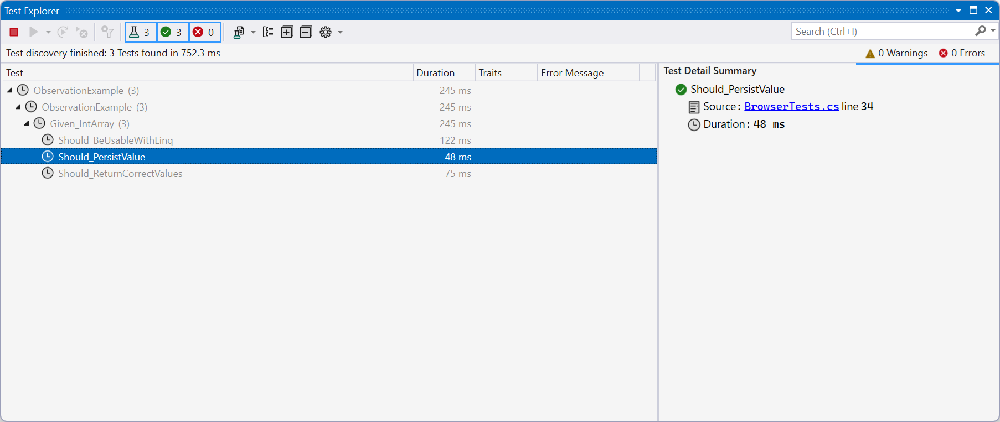
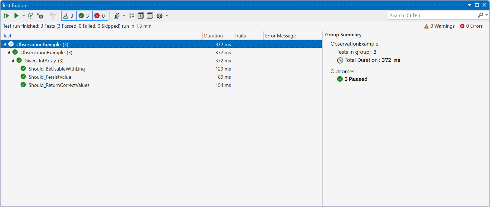
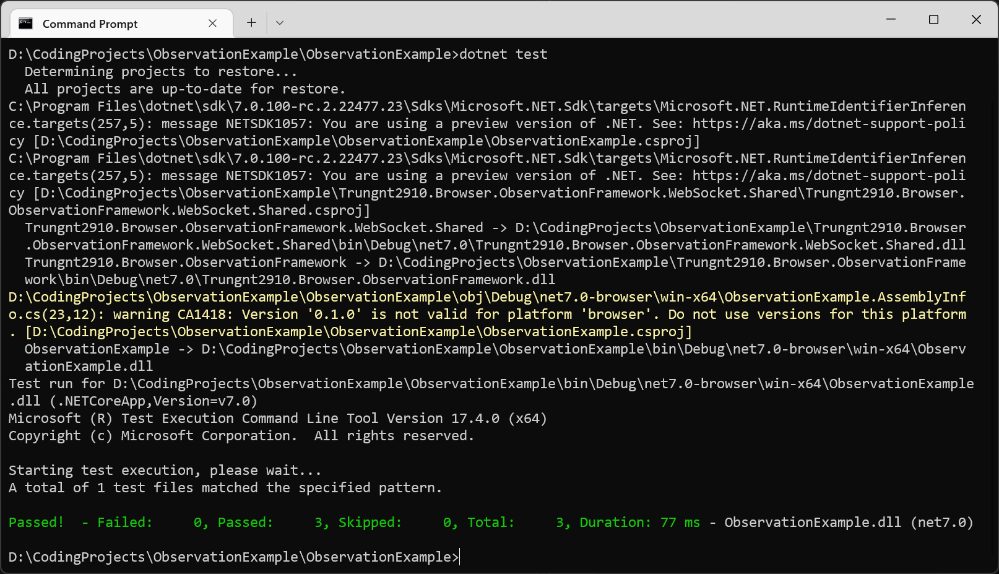

# Trungnt2910.Browser.ObservationFramework - Test Framework for DotnetBrowser

This project contains some extensions to `xUnit` to run unit tests for the `net7.0-browser` TFM.

Based on `xUnit`'s [ObservationExample](https://github.com/xunit/samples.xunit/tree/main/ObservationExample).

## How does it work

The framework embeds a custom WebAssembly test host built using the DotnetBrowser workload. During test execution, it:
- Extracts this custom host to a temporary folder.
- Starts a HTTP file server at a random open port.
- Launches a clean instance Microsoft Edge, navigating to the HTTP file server's address.
- Initializes a WebSocket connection with the test host at a random open port.
- Sends any required test assemblies through this WebSocket connection.
- Executes test commands through the WebSocket connection.

## Requirements

Requirements for running this test framework:
- The [DotnetBrowser](https://github.com/trungnt2910/DotnetBrowser) workload.
- Visual Studio 17.4.0 Preview or later.
- **Microsoft Edge**. Google Chrome or any other browsers are not supported.
- Only Windows x64 is tested, but any other OSes supported by the .NET WASM toolchain and Microsoft Edge should be supported. 

## Test projects

To create a test project, reference the `Trungnt2910.Browser.ObservationFramework` project and add a few properties:

```xml
<Project Sdk="Microsoft.NET.Sdk">

  <PropertyGroup>
    <TargetFramework>$(_BrowserTfm)</TargetFramework>
    <!-- IMPORTANT: This enables certain workarounds in the DotnetBrowser workload. -->
    <IsTestProject>true</IsTestProject>
  </PropertyGroup>

  <ItemGroup>
    <!-- IMPORTANT: This allows xUnit to select the correct test framework. -->
    <AssemblyAttribute Include="Xunit.TestFrameworkAttribute">
      <_Parameter1>Trungnt2910.Browser.ObservationFramework.ObservationTestFramework</_Parameter1>
      <_Parameter2>Trungnt2910.Browser.ObservationFramework</_Parameter2>
    </AssemblyAttribute>
  </ItemGroup>

  <ItemGroup>
    <PackageReference Include="Microsoft.NET.Test.Sdk" Version="17.3.2" />
    <PackageReference Include="xunit.runner.visualstudio" Version="2.4.5">
      <PrivateAssets>all</PrivateAssets>
      <IncludeAssets>runtime; build; native; contentfiles; analyzers; buildtransitive</IncludeAssets>
    </PackageReference>
  </ItemGroup>

  <ItemGroup>
    <!-- Reference the test framework here, or a PackageReference if/when a NuGet package is available. -->
    <ProjectReference Include="..\Trungnt2910.Browser.ObservationFramework\Trungnt2910.Browser.ObservationFramework.csproj" />
  </ItemGroup>

</Project>
```

## Writing test classes

See this C# sample:

```csharp
using System;
using System.Linq;
using Trungnt2910.Browser;
using Trungnt2910.Browser.ObservationFramework;
using Xunit;

namespace ObservationExample;

public class Given_IntArray : Specification
{
    JsArray<int> _array;

    protected override void EstablishContext()
    {
        _array = JsArray<int>.FromExpression("[1, 2, 3]");
    }

    protected override void DestroyContext()
    {
        _array = null!;
    }

    [Observation]
    public void Should_ReturnCorrectValues()
    {
        Assert.Equal(1, _array[0]);
        Assert.Equal(2, _array[1]);
        Assert.Equal(3, _array[2]);
        Assert.ThrowsAny<Exception>(() => _array[3]);
        Assert.ThrowsAny<Exception>(() => _array[-1]);
    }

    [Observation]
    public void Should_PersistValue()
    {
        Assert.Equal(1, _array[0]);
        _array[0] = 69420;
        Assert.Equal(69420, _array[0]);
        _array[0] = 1;
        Assert.Equal(1, _array[0]);
    }

    [Observation]
    public void Should_BeUsableWithLinq()
    {
        Assert.True(_array.SequenceEqual(new[] { 1, 2, 3 }));
    }
}
```

- All test classes need to dervie from `Specification`.
- All test functions must be decorated with the `ObservationAttribute`.
- Override `EstablishContext` to initialize your test class, and `DestroyContext` to do any cleanup work.

## IDE integration

This test framework supports integration with `dotnet test` as well as Visual Studio testing.

### Running on Visual Studio




### Running with `dotnet test`


